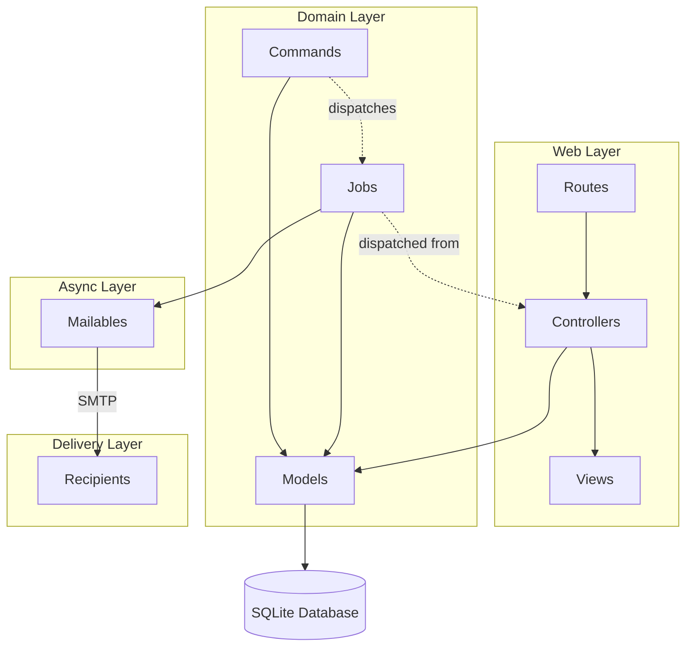

# Architecture Spine — SendFlow

## Design Paradigm

**Layered MVC with Queue-based Async Processing.** The application follows Laravel's standard MVC pattern:

| Layer | Laravel Mapping | Responsibility |
|---|---|---|
| Presentation (View) | `resources/views/` | Blade templates, Tailwind CSS, Alpine.js |
| Controller | `app/Http/Controllers/` | Request validation, auth, delegation |
| Model | `app/Models/` | Eloquent ORM, relationships, scopes |
| Job | `app/Jobs/` | Queueable async email delivery |
| Command | `app/Console/Commands/` | CLI scheduled tasks |
| Mail | `app/Mail/` | Mailable email builders |

Dependency direction: View → Controller → Model (Controllers depend on Models; Views receive data from Controllers). Jobs and Commands depend on Models and Mailables. Controllers never call Jobs synchronously for sending — they dispatch to the queue.

## Invariants & Rules

### AD-1 — Eloquent as sole data access layer `[ADOPTED]`

- **Binds:** all features
- **Prevents:** raw SQL queries, repository pattern, query builders outside Eloquent
- **Rule:** All database access goes through Eloquent models and their relationships. No raw DB:: queries or query builder outside of migrations.

### AD-2 — Pivot-based many-to-many for campaign targeting `[ADOPTED]`

- **Binds:** Campaign, Contact, Tag
- **Prevents:** storing recipient lists as JSON/text columns, single-contact foreign key as sole targeting mechanism
- **Rule:** Campaigns target recipients through two pivot tables: `campaign_contact` (individual contacts) and `campaign_tag` (tag groups). `allRecipients()` merges and deduplicates both sets.

### AD-3 — Database queue driver for async jobs `[ADOPTED]`

- **Binds:** SendCampaignJob, campaign sending
- **Prevents:** redis, SQS, or other external queue backends
- **Rule:** All queued jobs use the `database` queue driver. The queue worker runs via `php artisan queue:listen` (dev) or `php artisan queue:work` (production).

### AD-4 — Direct SMTP mailer per recipient `[ADOPTED]`

- **Binds:** CampaignMail, CampaignMailForContact, SendCampaignJob, ProcessAutomations
- **Prevents:** batch send APIs, third-party email delivery services as the primary send path
- **Rule:** Each email is sent individually via Symfony Mailer SMTP transport using `Mail::to()->send()`. There is no bulk/batch API integration.

### AD-5 — Database-level scheduler for time-based operations `[ADOPTED]`

- **Binds:** campaigns:send-scheduled, automations:process
- **Prevents:** external cron managers, event-driven scheduling
- **Rule:** All scheduled operations poll the database on a one-minute cron cycle. The Laravel scheduler runs the commands via `schedule:run`.

### AD-6 — Automation workflow state via dedicated audit table `[ADOPTED]`

- **Binds:** Automation, AutomationStep, AutomationLog
- **Prevents:** in-memory state tracking, external workflow engines
- **Rule:** Automation execution state is tracked in `automation_logs`. Each step execution creates a log entry. Idempotency: logs are checked before execution to prevent duplicate processing per contact.

### AD-7 — Status field as state machine `[ADOPTED]`

- **Binds:** Campaign, Automation
- **Prevents:** status calculated from derived data, multiple status columns
- **Rule:** Campaigns have a single `status` enum: draft → scheduled → sent (one-directional, no rollback). Automations have status: active, paused (bidirectional via toggle). Irreversible transitions are enforced in application code.

### AD-8 — SQLite as production-appropriate database `[ADOPTED]`

- **Binds:** all features
- **Prevents:** MySQL, PostgreSQL, or other database servers as the primary database
- **Rule:** Application uses SQLite via `DB_CONNECTION=sqlite`. Migrations must be compatible with SQLite syntax and constraints.

## Consistency Conventions

| Concern | Convention |
|---|---|
| Naming (models) | Singular, PascalCase, matches table name convention (snake_case plural) |
| Naming (controllers) | PascalCase, suffixed with `Controller` |
| Naming (migrations) | `YYYY_MM_DD_HHMMSS_descriptive_name` |
| IDs | Auto-increment integer primary keys on all tables |
| Timestamps | Laravel default `created_at`/`updated_at` on all entities; pivot tables use `withTimestamps()` |
| Foreign keys | Laravel convention: `{singular_model}_id` |
| Validation | Form request validation in controllers |
| Error handling | Controller returns flash messages + redirects; JSON responses for AJAX endpoints |
| Logging | Laravel logging facade for errors and audit |

## Stack

| Name | Version |
|---|---|
| PHP | ^8.2 |
| Laravel Framework | ^12.0 |
| SQLite | (bundled with PHP) |
| Laravel Sanctum | ^4.2 |
| Tailwind CSS | ^4.1 |
| Vite | ^7.0 |
| Alpine.js | (via CDN/npm) |
| Symfony Mailer | 7.4 |
| maatwebsite/excel | ^3.1 |
| PHPUnit | ^11.5 |

## Structural Seed

```text
sendflow/
  app/
    Http/Controllers/    # Request handling → delegates to Models, dispatches Jobs
    Models/              # Eloquent ORM — single data access layer
    Jobs/                # Queueable async email delivery
    Mail/                # Mailable class definitions
    Console/Commands/    # Scheduled operations (cron-polled)
  resources/views/       # Blade templates — server-rendered UI
  routes/                # Route definitions (web.php, api.php)
  database/migrations/   # Schema definitions
  config/                # Laravel configuration files
  tests/                 # PHPUnit tests (Feature + Unit)
```



## Deferred

- **Horizontal scaling:** The database queue driver limits throughput. Deferred until contact volume exceeds thousands of recipients per campaign.
- **Multi-tenant support:** Team/role model deferred — no user roles beyond authenticated/guest.
- **Email analytics:** Open/click/bounce tracking deferred — no webhook integration or tracking pixel infrastructure.
- **API surface expansion:** Currently minimal (`/api/contacts`). Full REST API deferred.
- **Third-party mailer provider abstraction:** Currently hard-wired to SMTP. Abstraction for SendGrid/Mailgun/etc. deferred.
- **Caching strategy:** No Redis/memcached configured. SQLite + database queue sufficient for current scale.
